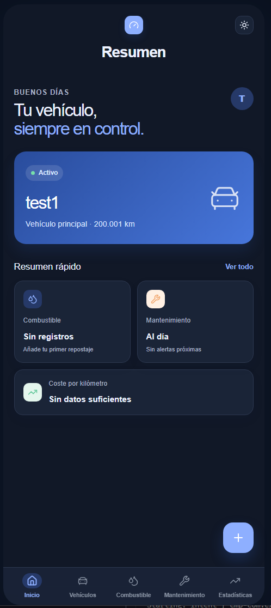

# Vehicle Manager

> Description: Smart vehicle management app — track fuel refuels, log maintenance services, and monitor your vehicle expenses with interactive dashboards and customizable reminders.



| | |
| --- | --- |
| **Status** | In Development |
| **License** | MIT |
| **Min SDK** | 26 (Android 8.0) |
| **Target SDK** | 35 |
| **Language** | Kotlin |
| **UI Framework** | Jetpack Compose |

---

📖 **Table of Contents**

- [Overview](#overview)
- [Architecture](#architecture)
- [Tech Stack](#tech-stack)
- [Features](#features)
- [Project Structure](#project-structure)
- [Getting Started](#getting-started)

---

## Overview

Vehicle Manager helps users keep track of their vehicles by recording fuel refuels, maintenance services, and odometer readings. Built with a clean, modern UI, the app provides visual summaries that make it easy to understand fuel consumption, maintenance costs, and overall vehicle usage over time.

## Architecture

The app follows a **Clean Architecture** approach organized into two main packages:

```
com.example.vehiclemanager/
├── core/           # Shared cross-cutting concerns
│   ├── domain/     # Domain models, repository interfaces, use cases
│   ├── data/       # Repository implementations, Room DAOs, DataStore, data sources
│   └── ui/         # Shared UI: theme, navigation, components, scaffold
│
└── feature/        # Feature modules (UI + feature-specific logic)
    ├── vehicles/   # Vehicle list and add/edit screens
    ├── fuel/       # Fuel refuel form and list
    ├── maintenance/# Maintenance service recording
    ├── settings/   # Theme, data export/import, reminders
    ├── dashboard/  # Summary charts and insights
    └── statistics/ # Advanced statistics and comparisons
```

### Layers

- **UI Layer** — Jetpack Compose screens with ViewModels managing UI state
- **Domain Layer** (`core/domain/`) — Domain models, repository interfaces, and use cases
- **Data Layer** (`core/data/`) — Room database (entities, DAOs, database class), DataStore preferences, and repository implementations

## Tech Stack

| Technology | Purpose |
| --- | --- |
| Kotlin | Primary programming language |
| Jetpack Compose | Modern declarative UI toolkit |
| Material 3 | Design system and components |
| Hilt | Dependency injection |
| Room | Local SQLite database |
| DataStore | User preferences persistence |
| Coroutines & Flow | Asynchronous programming |
| KSP | Kotlin Symbol Processing (Room schemas) |

## Features

### Vehicle Management
- Add and edit vehicle details (brand, model, license plate, odometer)
- View list of registered vehicles

### Fuel Tracking
- Record fuel refuels with odometer, price per liter, quantity, and auto-calculated total cost
- Automatic odometer updates propagate across all vehicle views

### Maintenance Tracking
- Log maintenance services with associated costs and odometer readings
- Track service history per vehicle

### Dashboard & Analytics
- Monthly, quarterly, semi-annual, and annual summaries
- Charts and visual insights for fuel and maintenance spending

### Settings & Reminders
- Light and dark theme support
- Data export and import
- Customizable reminders:
  - Fuel refill notifications (km and days in advance)
  - Tire pressure alerts
  - Notification time and vibration preferences

## Project Structure

The project follows a layered architecture:

- `core/`: Shared domain models, repositories, and UI components
- `feature/`: Feature modules (vehicles, fuel, maintenance, settings, dashboard)
- `app/`: Application entry point and dependency injection setup

## Getting Started

### Prerequisites

- Android Studio (latest stable version recommended)
- JDK 21 or higher
- Android SDK 35 (compile target), min SDK 26

### Build & Run

```bash
# Clone the repository
git clone <repository-url>
cd vehicle-manager

# Build the debug APK
./gradlew assembleDebug

# Run tests
./gradlew testDebugUnitTest

# Install on connected device/emulator
./gradlew installDebugDebug
```

### Project Configuration

- Version catalog: `gradle/libs.versions.toml`
- Room schemas exported to: `app/schemas`
- Local properties: `local.properties` (not tracked in version control)

---

Built with ❤️ using Kotlin, Jetpack Compose, and Clean Architecture.